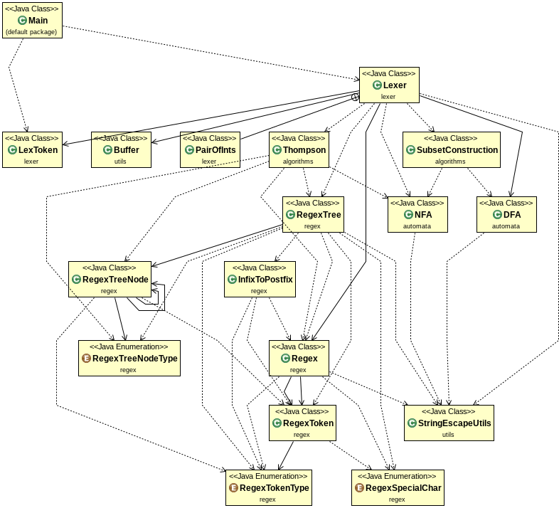

Some information regarding the project.

### Project Structure 
```
.
├── bin
|   └── <will contain compiled objects>
├── README.md
├── src
    ├── algorithms
    │   ├── SubsetConstruction.java
    │   └── Thompson.java
    ├── automata
    │   ├── DFA.java
    │   └── NFA.java
    ├── lexer
    │   ├── Lexer.java
    │   └── LexToken.java
    ├── Main.java
    ├── regex
    │   ├── InfixToPostfix.java
    │   ├── Regex.java
    │   ├── RegexSpecialChar.java
    │   ├── RegexToken.java
    │   ├── RegexTokenType.java
    │   ├── RegexTree.java
    │   ├── RegexTreeNode.java
    │   └── RegexTreeNodeType.java
    └── utils
        ├── Buffer.java
        └── StringEscapeUtils.java
```

### Package Information

1. `algorithms` - implementation of Thompson and Subset Construction Algorithm
2. `automata` - finite state machines
3. `lexer` - lexical analyzer
4. `regex` - regular expression parsing, and utilities like shunting yard algorithm and tree generation
5. `utils` - utility classes for support

### UML Diagram


### Compilation

Follow the above folder stucture. For compilation use `javac`. Mention the classpath (`-cp`), the destination (`-d`) and the encoding (`-encoding`).

```
syntax_analyzer>javac -cp src/ -d bin/ -encoding utf-8 src/Main.java
```

*Notes*: 

- The encoding should be `utf-8`. This is to support the epsilon (ε) symbol in the code.
- Wildcards (`*`, `*.java`, etc) may be used in the filenames to compile everything in one go.

### Execution

Use the `java` command. Link the compiled binaries in the classpath. Refer to classes by their fully qualified package name before the class name. The `-v`, is an optional arguement, when enabled the intermediate regex trees, NFAs and DFAs are printed on the console.

```
syntax analyzer>java -cp bin/ Main <regex_file> <program_file> <output_symbol_table_file> -v
```
### Regex file syntax
In the regex file we can add our token describtions. Each line contains one token describtion. The syntax is as follows:
```
<token_name> <regex_exp>
```
##### Rules
- In token name do not use spaces since it is a seperator
- Special chars like `*`, `.` are reserved and have special meanings, like `*` means closure. In order to use these, use escape chars like `\*`.
- All symbols allowed in regex expression.
- `[azAZ09]` type ranges supported. For example [az] denotes all characters from `a` to `z`
- Common escape sequence chars supported like `\n` `\r` `\t`
- Unicode escape supported e.g. `\u0020` is space

##### Supported special regex chars
- Bracket close `)`, 
- Bracket open `(`,
- Closure `*`,
- Concat `.`,
- Epsilon `ε`,
- Escape `\`,
- Range close `]`,
- Range open`[`,
- Union `|`;
    
##### Example regex file
```
KEYWORD int|float|return|main|for|if|else
INTEGER [09][09]*
FLOAT (([09][09]*\.[09]*)|([09]*\.[09][09]*))(ε|((e|E)(+|-|ε)[09][09]*))
IDENTIFIER (_|[AZaz])(_|[09AZaz])*
PUNCTUATOR {|}|\(|\)|;|,
WHITESPACE (\u0020|\t|\r|\n)(\u0020|\t|\r|\n)*
ASSIGN_OP =
REL_OP <|>|==|<=|>=
ARITH_OP +|-|/|\*
```

### Part 1 Table (change name)

| Type | actualRegex  | regexUsed  |
| :----: | :-------------------------------: | :---------------------------------------: |
| KEYWORD | int &#124; float &#124; return | int &#124; float &#124; return |
| IDENTIFIER | [_A-Za-z][_0-9A-Za-z]* | (_ &#124;[AZaz])(_ &#124;[09AZaz])* |
| INTEGER | (+&#124;-)?[0-9][0-9]* | (+&#124;-&#124;ε)[09][09]* |
| FLOAT | (+&#124;-)?(([0-9]+&#92;.[0-9]* )&#124;([0-9]*&#92;.[0-9]+))((e&#124;E)(+&#124;-)[0-9]+)) | (+&#124;-&#124;ε)(([09][09]*&#92;.[09]*)&#124;([09]*&#92;.[09][09]*))(ε&#124;((e&#124;E)(+&#124;-&#124;ε)[09][09]*)) |

