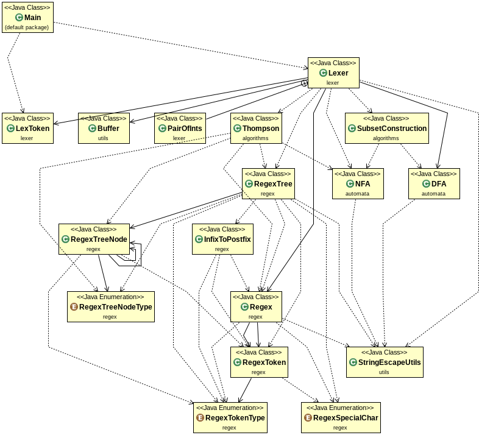

Some information regarding the project.

### Project Structure 
```
.
├── bin
|   └── <will contain compiled objects>
├── README.md
├── src
    ├── algorithms
    │   ├── SubsetConstruction.java
    │   └── Thompson.java
    ├── automata
    │   ├── DFA.java
    │   └── NFA.java
    ├── lexer
    │   ├── Lexer.java
    │   └── LexToken.java
    ├── Main.java
    ├── regex
    │   ├── InfixToPostfix.java
    │   ├── Regex.java
    │   ├── RegexSpecialChar.java
    │   ├── RegexToken.java
    │   ├── RegexTokenType.java
    │   ├── RegexTree.java
    │   ├── RegexTreeNode.java
    │   └── RegexTreeNodeType.java
    └── utils
        ├── Buffer.java
        └── StringEscapeUtils.java
```

### Package Information

1. ['algorithms'] - implementation of Thompson and Subset Construction Algorithm
2. [`automata`](docs/automata.md) - finite state machines
3. ['lexer'] - lexical analyzer
4. [`regex`](docs/regex.md) - regular expression parsing, and utilities like shunting yard algorithm and tree generation
5. ['utils'] - utility classes for support

### UML Diagram


### Compilation

Follow the above folder stucture. For compilation use `javac`. Mention the classpath (`-cp`), the destination (`-d`) and the encoding (`-encoding`).

```
syntax_analyzer>javac -cp src/ -d bin/ -encoding utf-8 src/Main.java
```

*Notes*: 

- The encoding should be `utf-8`. This is to support the epsilon (ε) symbol in the code.
- Wildcards (`*`, `*.java`, etc) may be used in the filenames to compile everything in one go.

### Execution

Use the `java` command. Link the compiled binaries in the classpath. Refer to classes by their fully qualified package name before the class name. The `-v`, is an optional arguement, when enabled the intermediate regex trees, NFAs and DFAs are printed on the console.

```
syntax analyzer>java -cp bin/ Main <regex_file> <program_file> <output_symbol_table_file> -v
```
